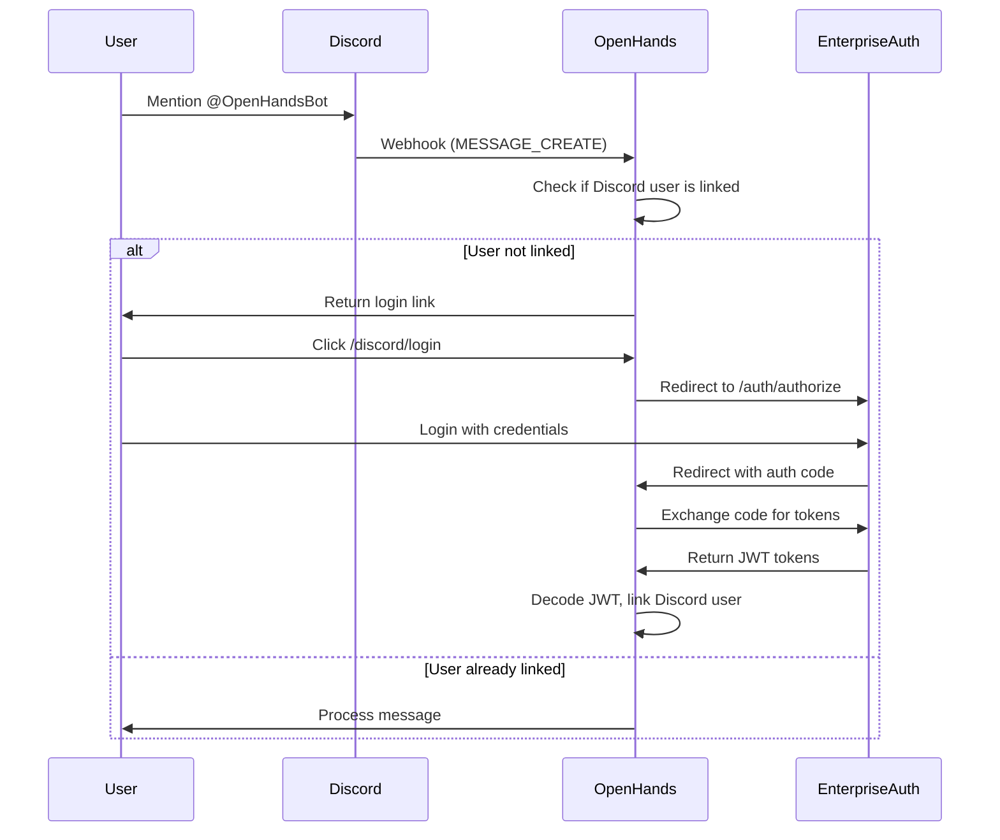

# Enterprise Authentication Integration

This document describes how to integrate a custom enterprise backend with OpenHands for Discord authentication, replacing Keycloak.

## Overview

OpenHands enterprise now supports two authentication backends:
1. **Keycloak** (default) - Full OIDC/OAuth2 support
2. **Enterprise Auth** (custom) - JWT-based authentication for any backend (NestJS, Express, FastAPI, etc.)

Set the `ENTERPRISE_AUTH_URL` environment variable to enable enterprise authentication.

## Configuration

### Environment Variables

```bash
# Required - Set this to enable Enterprise auth
ENTERPRISE_AUTH_URL=http://localhost:3001

# Optional - External URL for browser-facing operations
ENTERPRISE_AUTH_URL_EXT=https://api.yourdomain.com

# Optional - JWT secret for HS256 verification (if using shared secret)
ENTERPRISE_AUTH_JWT_SECRET=your-jwt-secret

# Optional - JWT public key for RS256 verification (if using RSA)
ENTERPRISE_AUTH_JWT_PUBLIC_KEY="-----BEGIN PUBLIC KEY-----\n...\n-----END PUBLIC KEY-----"
```

### How It Works

1. When a Discord user tries to use the bot, they receive a login link
2. If `ENTERPRISE_AUTH_URL` is set, the user is redirected to the enterprise auth page
3. After authentication, the backend redirects back to OpenHands with an authorization code
4. OpenHands exchanges the code for JWT tokens
5. The JWT is decoded to extract user information
6. The Discord user is linked to the OpenHands user

## Required Backend Endpoints

Your enterprise backend should implement the following endpoints:

### 1. Authorization Endpoint

```
GET /auth/authorize?redirect_uri={redirect_uri}&state={state}
```

- Redirects the user to the login page
- After successful login, redirects to `redirect_uri` with `code` and `state` parameters

### 2. Token Endpoint

```
POST /auth/token
Content-Type: application/json

{
  "code": "authorization_code",
  "redirect_uri": "https://your-openhands-url/discord/enterprise-callback",
  "grant_type": "authorization_code"
}
```

**Response:**
```json
{
  "access_token": "jwt_access_token",
  "refresh_token": "jwt_refresh_token",
  "expires_in": 3600
}
```

### 3. Login Page (Optional - for direct login flow)

```
GET /auth/login?redirect_uri={redirect_uri}&state={state}
```

- Renders a login form
- On success, redirects to `redirect_uri` with `code` and `state`

### 4. User Info Endpoint (Optional)

```
GET /auth/userinfo
Authorization: Bearer {access_token}
```

**Response:**
```json
{
  "sub": "user-uuid",
  "email": "user@example.com",
  "preferred_username": "username",
  "email_verified": true
}
```

### 5. Token Refresh Endpoint (Optional)

```
POST /auth/refresh
Content-Type: application/json

{
  "refresh_token": "jwt_refresh_token"
}
```

**Response:**
```json
{
  "access_token": "new_jwt_access_token",
  "refresh_token": "new_jwt_refresh_token",
  "expires_in": 3600
}
```

## JWT Token Requirements

The JWT access token must contain the following claims:

| Claim | Type | Required | Description |
|-------|------|----------|-------------|
| `sub` | string | ✅ | Unique user identifier |
| `email` | string | ✅ | User email address |
| `email_verified` | boolean | | Email verification status |
| `preferred_username` | string | | Display name |
| `name` | string | | Full name |
| `given_name` | string | | First name |
| `family_name` | string | | Last name |
| `exp` | number | ✅ | Expiration timestamp |
| `iat` | number | | Issued at timestamp |

### Example JWT Payload

```json
{
  "sub": "123e4567-e89b-12d3-a456-426614174000",
  "email": "user@example.com",
  "preferred_username": "johndoe",
  "email_verified": true,
  "name": "John Doe",
  "given_name": "John",
  "family_name": "Doe",
  "exp": 1710000000,
  "iat": 1709996400
}
```

## Discord Integration Flow



## Testing the Integration

### 1. Set Environment Variables

```bash
export ENTERPRISE_AUTH_URL=http://localhost:3001
export ENTERPRISE_AUTH_JWT_SECRET=your-jwt-secret
```

### 2. Start OpenHands

```bash
cd enterprise
make run
```

### 3. Test Discord Login

1. Go to your Discord server
2. Mention the bot: `@OpenHandsBot hello`
3. Click the login link provided
4. You should be redirected to your enterprise auth login page
5. After login, you should be redirected back to OpenHands
6. The Discord account should be linked

## Troubleshooting

### Common Issues

1. **"Enterprise auth backend URL not configured"**
   - Make sure `ENTERPRISE_AUTH_URL` is set

2. **"Failed to get Enterprise auth tokens"**
   - Check that your backend is running
   - Verify the `/auth/token` endpoint is accessible
   - Check logs for detailed error messages

3. **"Failed to decode Enterprise auth token"**
   - Verify the JWT format is correct
   - Check that required claims (`sub`, `email`) are present
   - If using RS256, verify `ENTERPRISE_AUTH_JWT_PUBLIC_KEY` is correct

4. **Redirect loop**
   - Make sure the redirect URI in your backend config matches exactly
   - Check that state parameter is being passed correctly

### Debug Logging

Enable debug logging to see more details:

```python
import logging
logging.getLogger('server.auth.enterprise_auth_client').setLevel(logging.DEBUG)
```

## Migration from Keycloak

If you're migrating from Keycloak:

1. **Database**: The `discord_users` table uses `keycloak_user_id` column. This can store any user ID, not just Keycloak IDs.

2. **User Store**: OpenHands will create user records automatically if they don't exist, using the JWT claims.

3. **API Keys**: Each user still needs their own LLM API key. This is managed separately from authentication.

## Files Modified

- `enterprise/server/auth/constants.py` - Added enterprise auth configuration variables
- `enterprise/server/auth/enterprise_auth_client.py` - New enterprise auth client
- `enterprise/server/routes/integration/discord.py` - Updated to support both Keycloak and enterprise auth

## Support

For issues or questions, please open an issue on GitHub or contact the OpenHands team.
